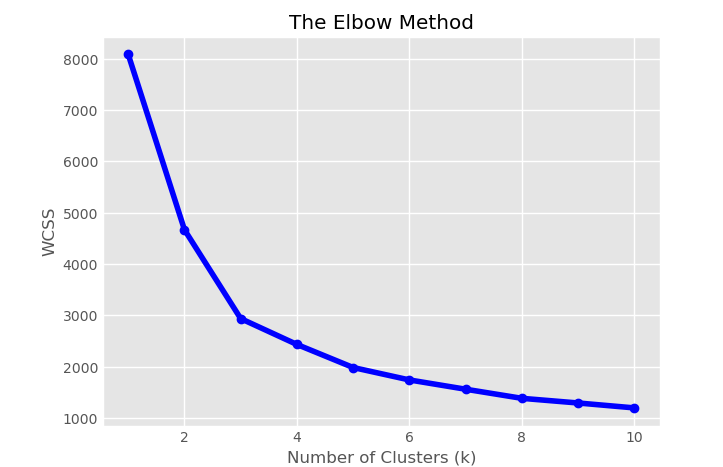
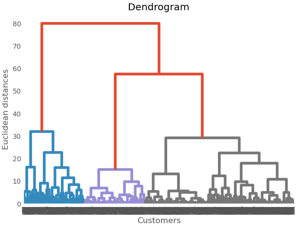
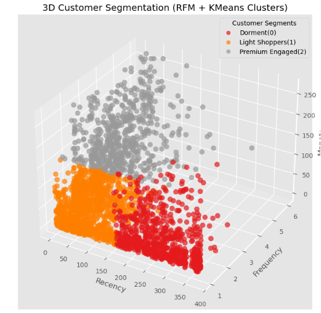

# 🛍️ Customer Segmentation Using RFM & K-Means Clustering

## 📌 Project Overview

This project segments retail customers using **RFM analysis** (Recency, Frequency, Monetary) and **K-Means Clustering** to help the marketing team personalize campaigns, improve retention, and boost revenue.

---

## 🎯 Business Objective

> Identify distinct customer groups based on behavior to enable targeted offers, re-engagement strategies, and loyalty campaigns.

---

## 📊 RFM Features

- **Recency (R):** Days since last purchase
- **Frequency (F):** Total number of purchases
- **Monetary (M):** Total amount spent

---

## 🤖 Modeling & Clustering

- RFM values scaled using `StandardScaler`
- Used **Elbow Method** & **Dendrogram** to find optimal clusters
- Applied **K-Means Clustering** with `k=3`
- Visualized results in 3D (RFM space)

---

## 📊 Segment Insights

| Segment | Behavior            | Strategy                            |
|---------|---------------------|-------------------------------------|
| 0       | Dormant             | Win-back offers, churn prevention   |
| 1       | Light Shoppers      | Nurturing, upselling opportunities  |
| 2       | Premium Engaged     | Loyalty rewards, referrals, VIP     |

---

## 🖼️ Visualizations

### Elbow Method  

### Dendrogram Method

### 3D RFM Customer Segments  

---

## 🛠️ Tools Used

- Python
- Pandas, NumPy
- Scikit-learn
- Matplotlib, Seaborn
- Jupyter Notebook

---

## 🚀 Future Enhancements

- Try **Gaussian Mixture Models (GMM)** or **DBSCAN** for more flexible clusters 
- Add **Silhouette Score** to evaluate cluster separation
- Enrich segmentation with **seasonality**, **category preferences**, or **lifetime value**
- Deploy a **Streamlit dashboard** for interactive cluster exploration

---

## 👨‍💻 Author

**Lunsheth Uvaish**  
📧 Owaish06@gmail.com  
🔗 [GitHub Profile](https://github.com/UvaishLunsheth)

